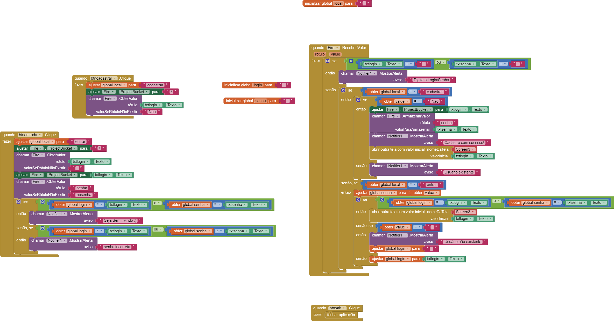
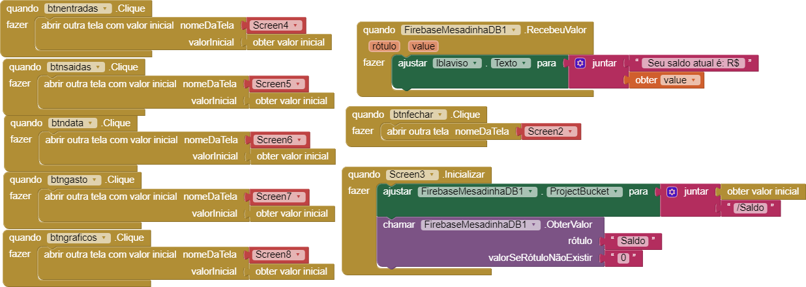
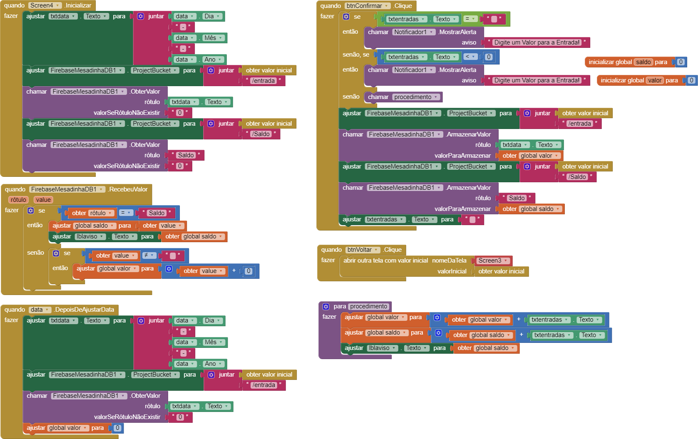
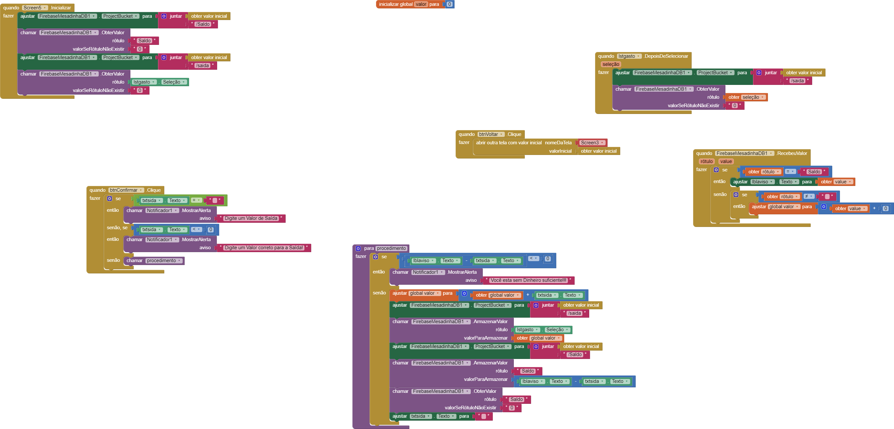
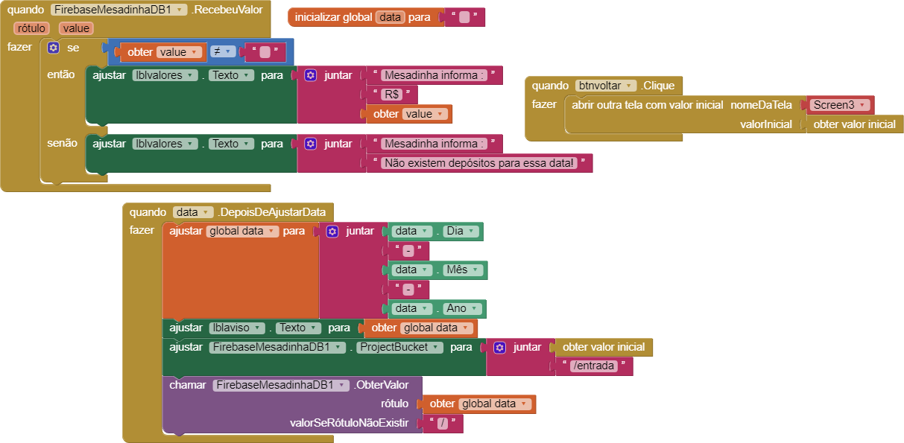
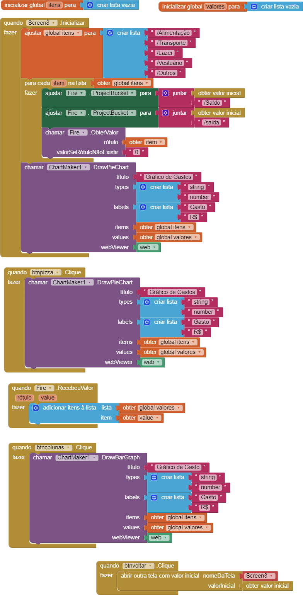
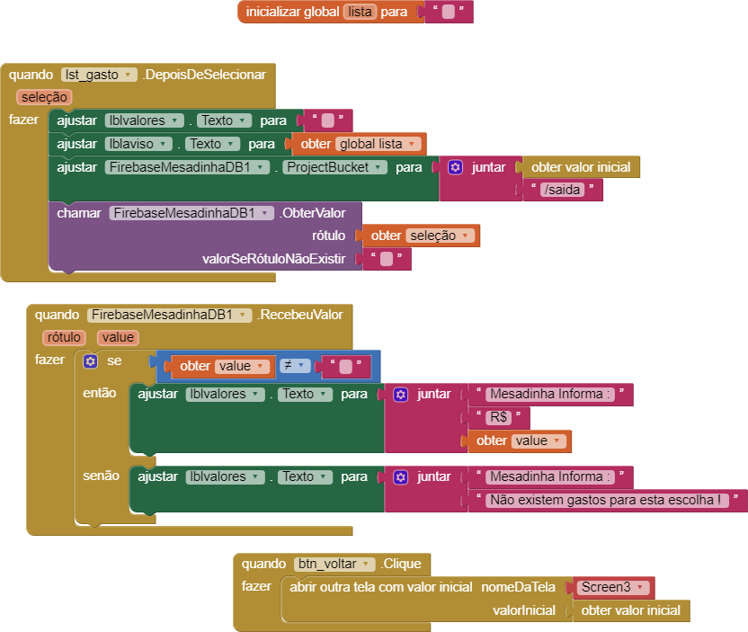

# Mesadinha — Personal Finance App (MIT App Inventor + Firebase)

Personal project developed with **MIT App Inventor**, using **Firebase Realtime Database** for data persistence. The app works as a "digital allowance manager", allowing users to create an account and log in, record income and expenses, check their balance by date, and visualize spending through charts.

> This repository documents the project's logic through App Inventor's blocks (Blockly), since the original `.aia` file was created and tested directly in the MIT App Inventor online editor before being versioned here.

## Development Environment

The project was originally developed using the MIT App Inventor editor in 2021.

## Screens and Features

| # | Screen | Description |
|---|------|-----------|
| 1 | [Login and Registration](docs/01-tela-login-e-cadastro.png) | Allows users to create an account (username/password) or log in to an existing one, using Firebase as a simple authentication backend. Validates empty fields, checks whether a username already exists during registration, verifies the password during login, and displays alerts for each case. |
| 2 | [Main Menu and Balance](docs/02-menu-principal-e-saldo.png) | The initial screen after login. Retrieves the current balance from Firebase and displays it on screen. From here, the user can navigate to the Income, Expenses, Date Lookup, Spending, and Charts screens. |
| 3 | [Income Screen](docs/03-tela-entradas.png) | Records received amounts, such as allowances or gifts, adds them to the current balance, and stores both the income amount associated with its date and the updated balance in Firebase. |
| 4 | [Expense Screen](docs/04-tela-saidas.png) | Records expenses by category, such as Food, Transportation, and Leisure. Checks whether there is sufficient balance before confirming an expense and notifies the user if there is insufficient balance. Updates the balance and stores the expense by category in Firebase. |
| 5 | [Date Lookup](docs/05-consulta-por-data.png) | Allows the user to select a date and check whether an income transaction was recorded on that day by retrieving the corresponding value stored in Firebase. |
| 6 | [Spending Charts](docs/06-graficos-de-gastos.png) | Generates pie and column charts showing spending by category using the ChartMaker component. The data comes from expenses stored in Firebase and is grouped into categories such as Food, Transportation, Leisure, Clothing, and Other. |
| 7 | [Expense Lookup by Category](docs/07-consulta-gasto-por-categoria.png) | When a category is selected from a list, the app retrieves the total amount spent in that category from Firebase and displays it, or notifies the user if no expenses have been recorded. |
| 8 | [Splash Screen / Timer](docs/08-splash-temporizador.png) | Opening screen of the app. A timer is triggered and automatically takes the user to the Login screen (Screen2) after a few seconds. |

## Technologies Used

- **MIT App Inventor** (block-based programming)
- **Firebase Realtime Database** (storage of users, balances, income, and expenses)
- **ChartMaker** (extension for generating pie and column charts)

## Designer

The Designer view shows the components and interface of the project's login and registration screen.

## Blocks

The Blocks view shows the programming logic implemented for the registration button.

## Block Logic

The following screenshots show the block-based programming logic implemented in the project.

### Login and Registration

### Main Menu and Balance

### Income

### Expenses

### Date Lookup

### Spending Charts

### Expense Lookup by Category

### Splash Screen

