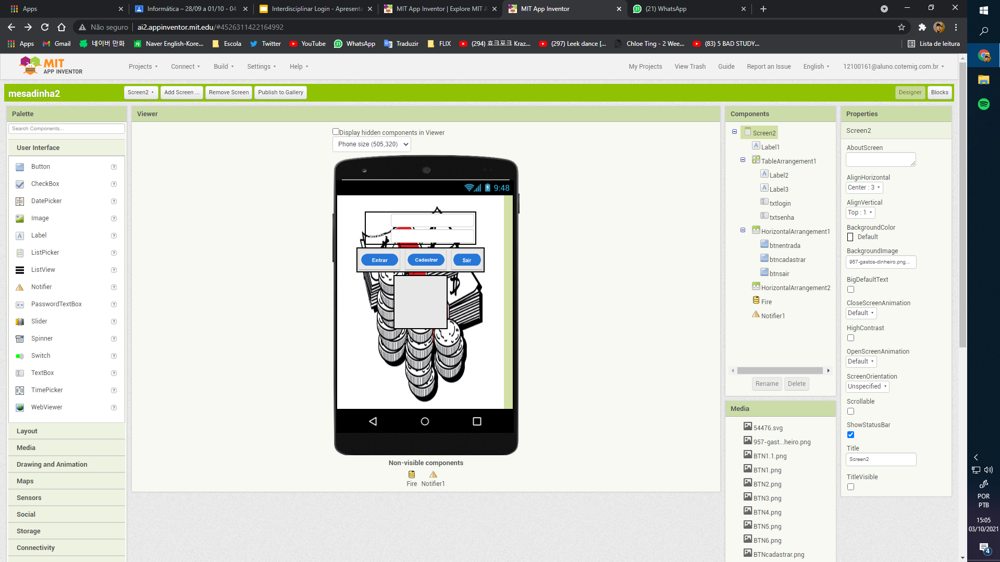
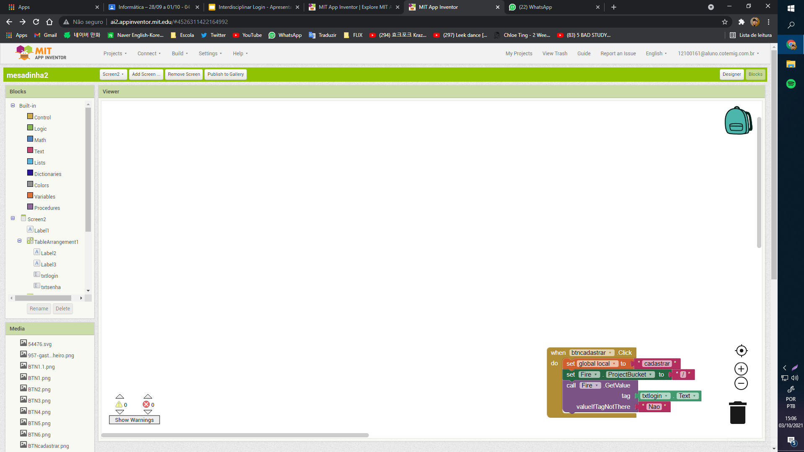

# Development Environment

The project was originally developed using the MIT App Inventor editor in 2021.

## Designer

The Designer view shows the components and interface of the project's login and registration screen.

## Blocks

The Blocks view shows the programming logic implemented for the registration button.

The system clock visible in both screenshots shows **October 3, 2021, at approximately 15:05–15:06**, providing evidence that the project was already under development at that time.